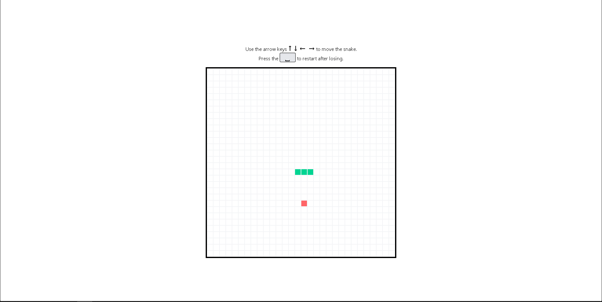

# 🐍 Snake Game - Next.js + Tailwind CSS

Un juego clásico de Snake desarrollado con [Next.js](https://nextjs.org/) y estilizado con [Tailwind CSS](https://tailwindcss.com/). El objetivo es simple: controla la serpiente, come la comida, y evita chocar contigo mismo. ¡Cada comida que consumes te hace más largo y el juego más desafiante!

---

## 🎮 Demo

[🚀 Ver juego en vivo](https://snake-web-app.vercel.app/)  

---

## 🧰 Tecnologías Utilizadas

- 🔹 [Next.js](https://nextjs.org/) – Framework de React con SSR y optimización automática
- 🔹 [React](https://react.dev/) – Librería de UI basada en componentes
- 🔹 [Tailwind CSS](https://tailwindcss.com/) – Framework de utilidades para estilos rápidos y personalizables
- 🔹 [TypeScript](https://www.typescriptlang.org/)

---

## 🚀 Características

- ✅ Movimiento en tiempo real con teclas de flecha y awsd
- ✅ Sistema de colisiones y reinicio automático

---

## ⚠️ Aviso

🖥️ Este proyecto está pensado **únicamente para vista en computadoras**.  
📱 Dispositivos móviles o tablets **no están soportados**.

---

## 📦 Instalación y uso

Clona el repositorio e instala las dependencias:

```bash
git clone https://github.com/Jonvtvn/snake.git
```
```bash
cd snake-nextjs
```
```bash
npm install
```
```bash
npm run dev
```

---

## 📸 Capturas del sitio

A continuación se muestran algunas vistas del diseño de la página:


